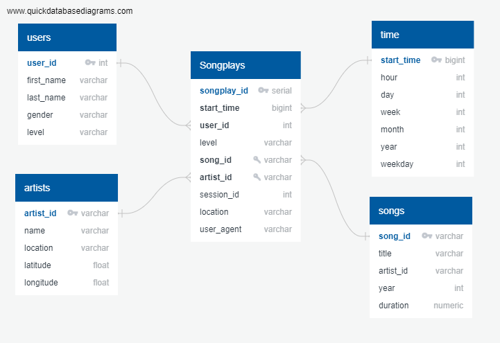

# Sparkify: Data Modeling with Postgres
*A udacity project*
___
## Project Overview

**Goal:** to analyze the data on user activity for Sparkify's new music streaming app.

**Problem:** Data resides in a directory of JSON logs on user activity on the app, as well as a directory with JSON metadata on the songs in their app.

**Solution:** To create a Postgres database with tables designed to optimize queries on song play analysis. To do this, will create a database schema and implement an ETL pipeline for easy extraction of key data. 

___

### Database Schema and ETL Process

.

*Used [Quick Database Diagrams](https://app.quickdatabasediagrams.com/#/d/xPzxH8) to create above image.* 

The above diagram represents a star schema where we have one fact table named Songplays tied to four other dimension tables. The advantages of using this schema are **(1)** Allows for simpler querying **(2)** Simplifies business reporting logic and **(3)** can implement faster aggregations. *(Wikipedia 2023)*

etl.py file perform an ETL (Extract, Transform and Load) process to quickly populate the relevant tables created. 

- songs and artists tables obtained from data/song_data
- time and users data obtained from data/log_data

___

### How to run code?

1. Run create_tables.py in the terminal using python create_tables.py
2. Run through etl.ipynb. You can use test.ipynb to acknowledge if the code has sucessfully been running. 

## File Functions

- **create_tables.py:** Establishes connection with sparkify database. It creates and drops tables from the sql_queries.py file. 
- **sql_queries.py:** Creates the relveant fact and dimension tables. Stores them in a list so that they can be easily accessed by the create_tables.py file. 
- **etl.ipynb** and **etl.py:** Extracts, transofrms and loads data into created tables from the data/song_data and data/log_data folders. 
- **test.ipynb:** Conducts checks to see if our ETL processes ran smoothly. Runs sanity checks to ensure no issues in future. 